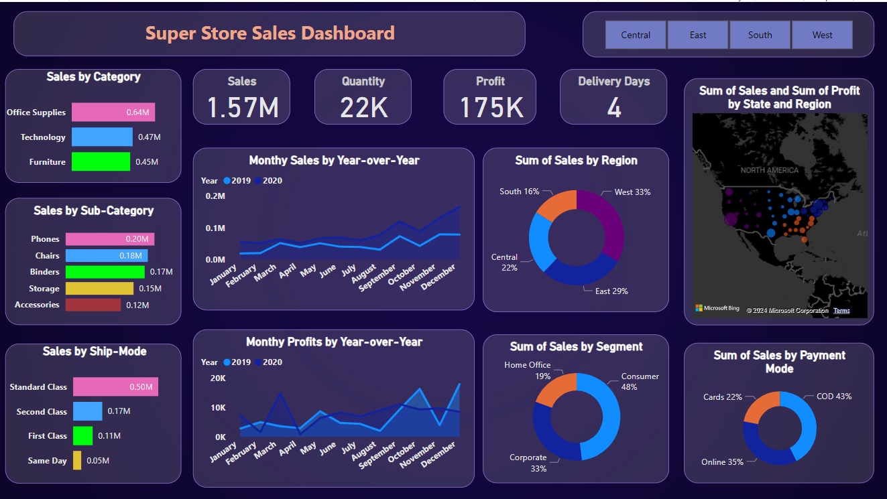
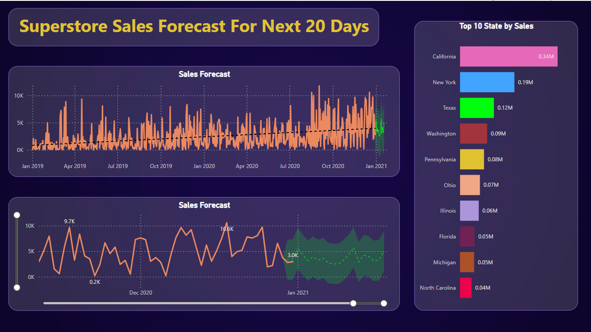

# SuperStore_Sales_Dashboard

## Overview
The Super Store Sales Dashboard is a powerful analytical tool created using Power BI to help visualize and analyze sales data. It provides insights into sales performance, trends, and key metrics to aid decision-making.

## Sales Performance Dashboard

This image showcases the main dashboard of the Super Store Sales Dashboard, highlighting several key metrics and visualizations:

**Sales by Category** : Displays sales figures across different product categories such as Office Supplies, Technology, and Furniture.  
**Sales by Sub-Category** : Breaks down sales by sub-categories, including Phones, Chairs, Binders, Storage, and Accessories.  
**Sales by Ship Mode** : Shows sales performance based on different shipping modes such as Standard Class, Second Class, First Class, and Same Day.  
**Monthly Sales by Year-over-Year** : Line chart comparing monthly sales across different years.  
**Sum of Sales by Region** : Pie chart showing the distribution of sales across various regions including South, Central, East, and West.  
**Sum of Sales and Profit by State and Region** : Map visual depicting sales and profit across different states and regions.  
**Monthly Profits by Year-over-Year** : Line chart comparing monthly profits across different years.  
**Sum of Sales by Segment** : Pie chart showing sales distribution across different segments like Home Office, Consumer, and Corporate.  
**Sum of Sales by Payment Mode** : Pie chart displaying sales by different payment methods including Cards, COD, and Online.  

## Sales Forecast Dashboard

This image highlights the sales forecast for the next 20 days, providing a predictive analysis of future sales trends:

**Sales Forecast** : Line chart showing the historical sales data along with a forecast for the next 20 days, highlighting trends and expected sales volumes.  
**Top 10 States by Sales** : Bar chart ranking the top 10 states by sales figures, with California, New York, and Texas leading the list.  

## Outcomes
By using the Super Store Sales Dashboard, organizations can achieve the following outcomes:

**Improved Decision Making** : With clear visualizations and real-time data, businesses can make informed decisions based on the latest sales trends and performance metrics.  
**Enhanced Sales Strategies** : Identifying top-performing products, categories, and regions allows for targeted marketing and sales strategies.  
**Operational Efficiency** : Understanding delivery times and shipping modes helps streamline logistics and improve customer satisfaction.  
**Forecasting Accuracy** : The sales forecast feature provides predictive insights that aid in inventory management and sales planning.  
**Increased Revenue** : By leveraging detailed sales analysis, businesses can identify opportunities for growth and increase overall revenue.  

## Features
Interactive visualizations  
Sales performance metrics  
Trend analysis  
Filter capabilities  

## Works Done on the Dataset
**Data Cleaning** :
    Removed duplicates and irrelevant data points.
    Filled or removed missing values to ensure data integrity.
    
**Data Transformation** :
    Converted data types to appropriate formats (e.g., dates, numeric values).
    Created calculated columns and measures for metrics like total sales, profit, and average order value.
    
**Data Aggregation** :
    Summarized data at different levels (e.g., monthly, yearly, by category, by region).
    Created aggregated tables and pivot tables for efficient data retrieval.
    
**Data Visualization** :
    Developed interactive charts, graphs, and maps to represent data visually.
    Applied filters and slicers for dynamic data exploration.

**Forecasting** :
    Implemented time series analysis for sales forecasting.
    Used historical data to predict future sales trends and volumes.
